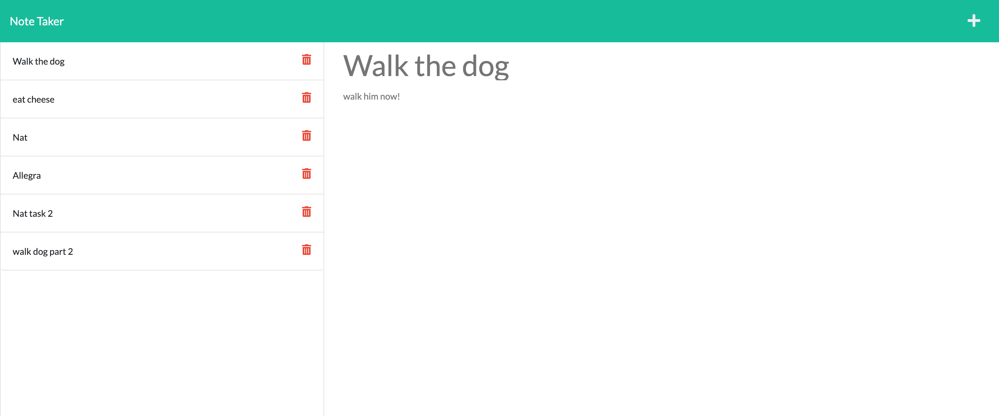
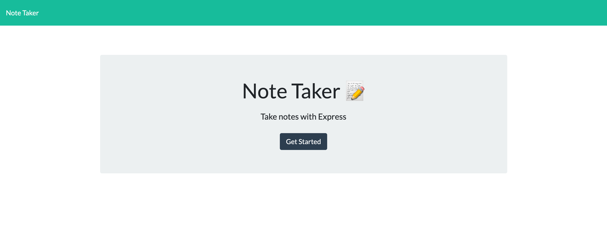
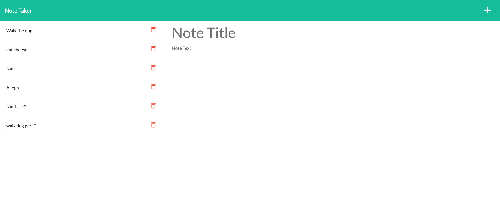

# Note-Taker
  
  
  ## Description 
  The goal of this project is to allow a user to retrieve, post and delete notes. The user can create a note and then save that note. The user can also delete old notes.

  ## Table of Contents
  * [Installation](#installation)
  * [Usage](#usage)
  * [Contributing](#contributing)
  * [Tests](#tests)
  * [License](#license)
  * [Bugs](#bugs)
  * [Questions](#questions)
  * [Media](#media)

  
  ## Installation 
  The user must first install node. After that the user will need to install express and uuid. Express will allow us to connect to the server and uuid is an npm that allows the program to create a uuid which is needed in order to select individual notes and to properly use the delete method.
  ## Usage 
  You will need to run npm init -y and npm i express as well as npm i uuid.
  ## Tests
  N/A
  ## License 
  This project is license under MIT License
  ## Bugs
  N/A

  ## Questions
  If you have any questions about this projects, please contact me directly at nathaniel.epstein@gmail.com. You can view more of my projects at https://github.com/natpitt2393.

  ## Media
  
  
  
  
  